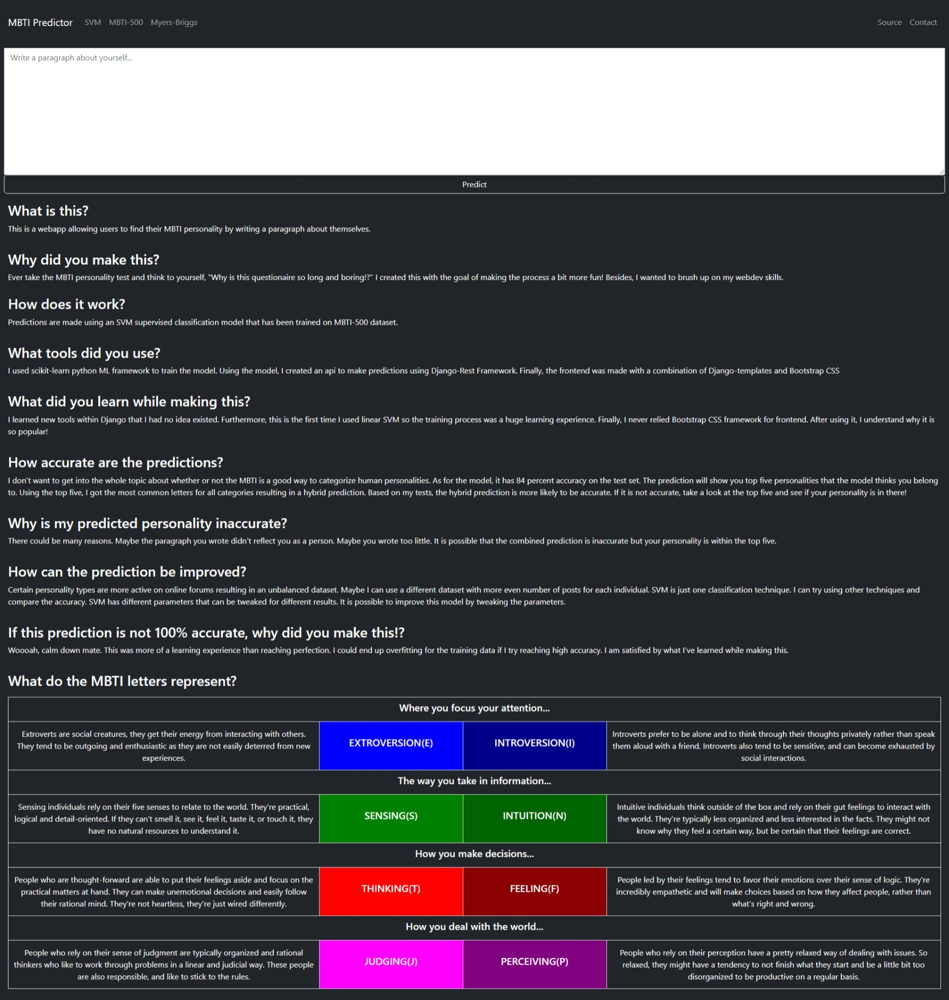
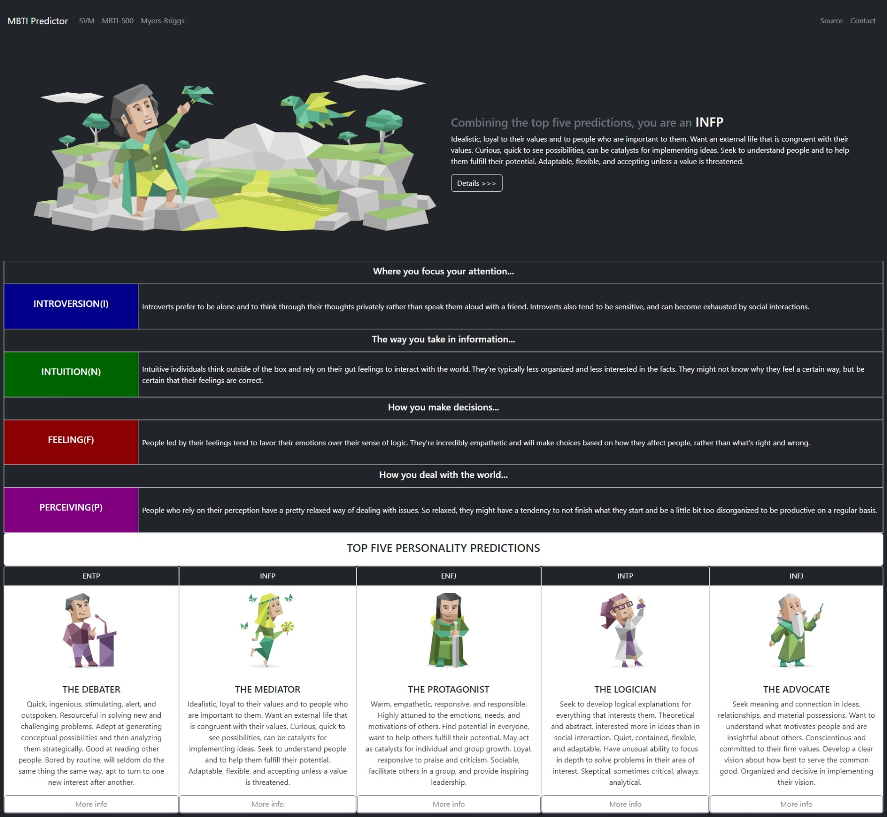

# MBTI-predictor

A webapp using a linear SVM model to predict mbti personality types given a paragraph. The model was trained using [MBTI-500](https://www.kaggle.com/datasets/zeyadkhalid/mbti-personality-types-500-dataset) dataset. The model was 84% accurate on the test set.

## Demo


### This is how the main page looks like:



### This is how the prediction page looks like:



## Responsive design made to work on mobile as well


## Running Locally
1. Clone the repository: `git clone https://github.com/Proto007/MBTI-predictor/`
2. Create and activate a virtualenvironment: https://docs.python.org/3/library/venv.html#creating-virtual-environments
3. Go to the directory of the project and install necessary dependencies:
```
cd MBTI-predictor
pip install -r requirements.txt
```
4. Go to the django project directory and make database migrations:
```
cd mbti_predictor
python manage.py makemigrations
python manage.py migrate
```
5. Run webapp in localhost: `python manage.py runserver`

## Tools used
**Frontend**: Django-template, Bootstrap CSS

**Backend**: Django-Rest-Framework

**ML framework**: scikit-learn
